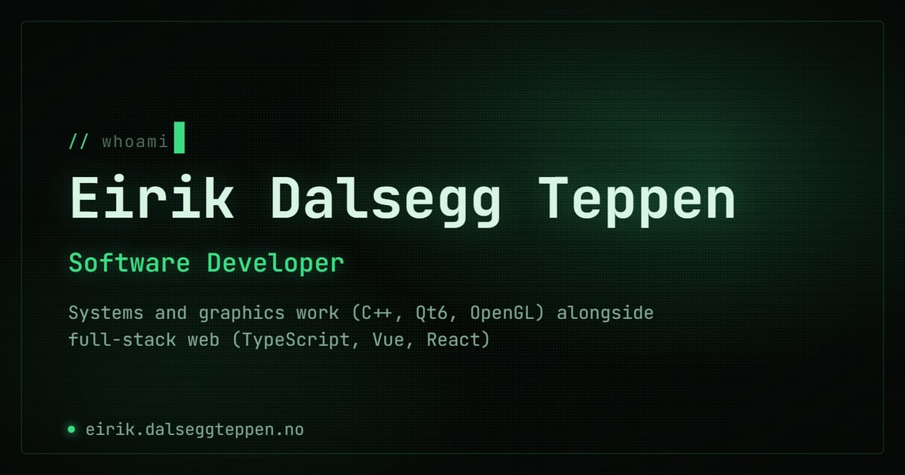

# tapawingo.github.io

Source for my personal portfolio, live at [eirik.dalseggteppen.no](https://eirik.dalseggteppen.no).



## Stack

- [Astro](https://astro.build/) with TypeScript, static output
- Vanilla CSS (component-scoped), no UI framework
- [Lenis](https://lenis.dev/) for smooth scrolling
- A hand-written WebGL fragment shader for the animated plasma background

## Notable bits

The plasma background started out as a CPU canvas-2D renderer (ported from an
[earlier project](https://github.com/Tapawingo/retro-plasma) of mine) and got
rewritten as a WebGL shader once it became clear a per-pixel JS loop just
wasn't going to hit 60fps. The shader lives in `src/lib/retroPlasma.ts`.

Scroll-based reveals and the plasma parallax drift in `src/lib/scrollFx.ts`
are driven continuously by scroll position on every frame, not a one-shot
IntersectionObserver toggle, so sections ease back out if you scroll past
them in either direction. Everything respects `prefers-reduced-motion`.

The site degrades gracefully without JavaScript: content defaults to visible
and only gets hidden for the reveal animation once a `js` class lands on
`<html>`, so nothing depends on a script running to be readable.

## Developing

```sh
npm install
npm run dev
```

| Command           | What it does                    |
| :---------------- | :------------------------------ |
| `npm run dev`     | Starts the local dev server     |
| `npm run build`   | Builds the site to `./dist`     |
| `npm run preview` | Serves the built output locally |

## License

MIT, see [LICENSE](LICENSE).
